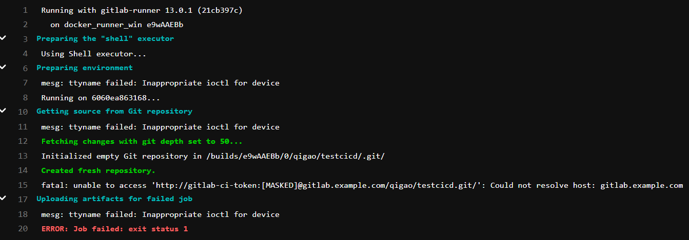

### 使用docker配置gitlab runner。
1. 注册一个runner。

 ```sh
 docker run --rm -t -i -v /srv/gitlab-runner/config:/etc/gitlab-runner gitlab/gitlab-runner register
 ```
 2. 运行runner

```
docker run --rm -t -i -v /srv/gitlab-runner/config:/etc/gitlab-runner gitlab/gitlab-runner run
```
结果：

#### 问题
1. 在注册并运行runner后，发现执行sampleCI仍然失败：



解决办法： 打开windows host 文件， 写入一行新的记录。IP地址为gitlab服务的host地址。
```
192.168.51.241 gitlab.example.com
```

### Gitlab CICD的一些设置

#### Setting->CI/CD->Gerneral pipelines.
1. 配置pipeline获取代码的方式。·`git clone`或者`git fetch`
	* 区别：https://segmentfault.com/a/1190000017030384

		