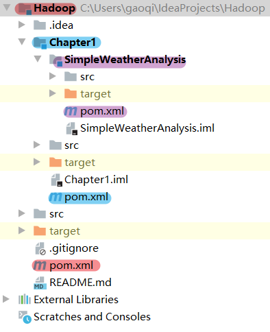

###  为module链编译jar包

#### 文件结构：


		
		

#### Hadoop.pom.xml

```xml?linenums
<?xml version="1.0" encoding="UTF-8"?>
<project xmlns="http://maven.apache.org/POM/4.0.0"
         xmlns:xsi="http://www.w3.org/2001/XMLSchema-instance"
         xsi:schemaLocation="http://maven.apache.org/POM/4.0.0 http://maven.apache.org/xsd/maven-4.0.0.xsd">
    <modelVersion>4.0.0</modelVersion>
    <groupId>Hadoop</groupId>
    <artifactId>Hadoop</artifactId>
    <packaging>pom</packaging>
    <version>1.0-SNAPSHOT</version>
    <modules>
        <module>
        Chapter1
    </module></modules>
    <build>
        <plugins>
            <plugin>
                <artifactId>maven-assembly-plugin</artifactId>
                <configuration>
                    <archive>
                        <manifest>
                            <addClasspath>true</addClasspath>
                            <mainClass>meta.FileRoot</mainClass>
                        </manifest>
                    </archive>
                    <descriptorRefs>
                        <descriptorRef>jar-with-dependencies</descriptorRef>
                    </descriptorRefs>
                </configuration>
                <executions>
                    <execution>
                        <id>make-assembly</id>
                        <phase>package</phase>
                        <goals>
                            <goal>single</goal>
                        </goals>
                    </execution>
                </executions>
            </plugin>
        </plugins>
    </build>
    <dependencies>
        <!-- https://mvnrepository.com/artifact/log4j/log4j -->
        <dependency>
            <groupId>log4j</groupId>
            <artifactId>log4j</artifactId>
            <version>1.2.17</version>
        </dependency>

        <!-- https://mvnrepository.com/artifact/org.apache.hadoop/hadoop-common -->
        <dependency>
            <groupId>org.apache.hadoop</groupId>
            <artifactId>hadoop-common</artifactId>
            <version>3.2.0</version>
        </dependency>
        <!-- https://mvnrepository.com/artifact/org.apache.hadoop/hadoop-mapreduce -->
        <dependency>
            <groupId>org.apache.hadoop</groupId>
            <artifactId>hadoop-mapreduce</artifactId>
            <version>3.2.0</version>
            <type>pom</type>
        </dependency>
        <!-- https://mvnrepository.com/artifact/org.apache.hadoop/hadoop-mapreduce-client-core -->
        <dependency>
            <groupId>org.apache.hadoop</groupId>
            <artifactId>hadoop-mapreduce-client-core</artifactId>
            <version>2.8.2</version>
        </dependency>

    </dependencies>
</project>
```

#### Chapter1.pom.xml

``` xml?linenums
<?xml version="1.0" encoding="UTF-8"?>
<project xmlns="http://maven.apache.org/POM/4.0.0"
         xmlns:xsi="http://www.w3.org/2001/XMLSchema-instance"
         xsi:schemaLocation="http://maven.apache.org/POM/4.0.0 http://maven.apache.org/xsd/maven-4.0.0.xsd">
    <modelVersion>4.0.0</modelVersion>
    <parent>
        <artifactId>Hadoop</artifactId>
        <groupId>Hadoop</groupId>
        <version>1.0-SNAPSHOT</version>
        <relativePath>../pom.xml</relativePath>
    </parent>
    <groupId>Hadoop</groupId>
    <artifactId>Chapter1</artifactId>
    <version>1.0-SNAPSHOT</version>
    <packaging>pom</packaging>

    <modules>
        <module>SimpleWeatherAnalysis</module>
    </modules>
    <build>
        <plugins>
            <plugin>
                <artifactId>maven-assembly-plugin</artifactId>
                <configuration>
                    <archive>
                        <manifest>
                            <mainClass>Default</mainClass>
                        </manifest>
                    </archive>
                    <descriptorRefs>
                        <descriptorRef>jar-with-dependencies</descriptorRef>
                    </descriptorRefs>
                </configuration>
                <executions>
                    <execution>
                        <id>make-assembly</id>
                        <phase>package</phase>
                        <goals>
                            <goal>single</goal>
                        </goals>
                    </execution>
                </executions>
            </plugin>
        </plugins>
    </build>
<dependencies>
    <dependency>
        <groupId>Hadoop</groupId>
        <artifactId>Hadoop</artifactId>
        <version>1.0-SNAPSHOT</version>
        <type>pom</type>
    </dependency>
</dependencies>
</project>
```

#### SimpleWeatherAnalysis.pom.xml

``` xml?linenums
<?xml version="1.0" encoding="UTF-8"?>
<project xmlns="http://maven.apache.org/POM/4.0.0"
         xmlns:xsi="http://www.w3.org/2001/XMLSchema-instance"
         xsi:schemaLocation="http://maven.apache.org/POM/4.0.0 http://maven.apache.org/xsd/maven-4.0.0.xsd">
    <parent>
        <artifactId>Chapter1</artifactId>
        <groupId>Hadoop</groupId>
        <version>1.0-SNAPSHOT</version>
        <relativePath>../pom.xml</relativePath>
    </parent>
    <modelVersion>4.0.0</modelVersion>
    <artifactId>SimpleWeatherAnalysis</artifactId>
<packaging>pom</packaging>
    <build>
        <plugins>
            <plugin>
                <artifactId>maven-assembly-plugin</artifactId>
                <configuration>
                    <outputDirectory>E:\Hadoop_Jar\</outputDirectory>
                    <archive>
                        <manifest>
                            <mainClass>MaxTemperature</mainClass>
                        </manifest>
                    </archive>
                    <descriptorRefs>
                        <descriptorRef>jar-with-dependencies</descriptorRef>
                    </descriptorRefs>
                </configuration>
                <executions>
                    <execution>
                        <id>make-assembly</id>
                        <phase>package</phase>
                        <goals>
                            <goal>assembly</goal>
                        </goals>
                    </execution>
                </executions>
            </plugin>
        </plugins>
    </build>

    <dependencies>
        <dependency>
            <groupId>Hadoop</groupId>
            <artifactId>Chapter1</artifactId>
            <version>1.0-SNAPSHOT</version>
            <type>pom</type>
        </dependency>
        <dependency>
            <groupId>Hadoop</groupId>
            <artifactId>Hadoop</artifactId>
            <version>1.0-SNAPSHOT</version>
            <type>pom</type>
            <scope>compile</scope>
        </dependency>
    </dependencies>

</project>
```