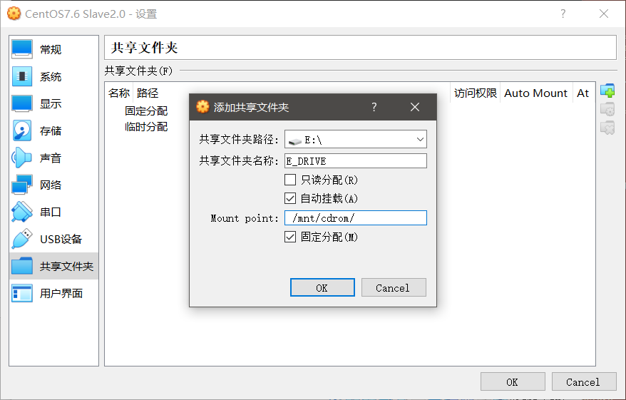

##### VirtualBox 在centos7上安装增强功能并共享文件夹
https://www.cnblogs.com/Reyzal/p/5509249.html

1. 
``` shell
yum install update
yum install kernel-headers
yum install kernel-devel
yum install gcc* 
yum install make
```
2. 执行`reboot`重启虚拟机
3. 等待完成后，点击VirtualBox工具栏的\[设备\]—\[安装增强功能\]。稍等片刻。
4. 

``` javascript
mkdir /mnt/cdrom
mount /dev/cdrom /mnt/cdrom
cd /mnt/cdrom
./VBoxLinuxAdditions.run
```
5. 在工具栏里的[设备]—[设置共享文件夹] 设置一个自己需要的文件夹。

6. 在虚拟机`/mnt/cdrom/`文件夹下，发现挂载成功。